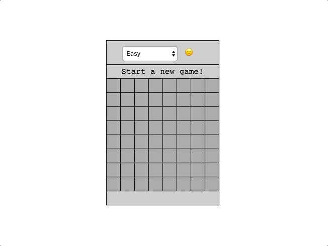

# React-Minesweeper

### See it live

https://react-minesweeper-dylanattal.surge.sh/

### Summary

This project is special to me because it was a lot of firsts. It was the first large project where I pulled data from an API; it was the first project where I broke down parts of the UI into React components; and it was the first project where I used MobX for state management.

I pulled data from the API https://minesweeper-api.herokuapp.com/. I used POST requests to create a new game, check a cell for a bomb, and flag cells that I thought had bombs in them. I imported the Axios library to perform API calls instead of using the standard `.fetch()`.

I broke down the UI into separate components in order to take advantage of repeating elements. The UI consists of the `Table`, `Board`, and `Cell` components. The `Table` includes the top two rows and bottom row which give information about the game, like the difficulty and the amount of mines left. The `Board` `map`s over data from the API and renders rows of `Cell`s. This functionality of React kept me from repeating a lot of code and ensured each `Cell` had the correct functions passed down to it to check its contents.

I chose to update the state of the game through MobX. I put the "difficulty," "number of mines left," and "won/lost" state into the `Game` component. That way when a player loses the game, the logic for displaying "You lose!" in the App.js file just references the state in `Game`.

### Project Goals

- [x] Create an app where the user can play a game of Minesweeper
- [x] Build out a UI that resembles traditional Minesweeper
- [x] Create three difficulty levels
- [x] Connect the front end to a given API
- [x] Create functions to handle checking the contents of a cell and flagging a cell
- [x] Create logic to display the number of mines left
- [x] Create logic to display the game number, "You win!" or "You lose!" based on the state of the game
- [x] Make a button that starts a new game

### Technologies Used

HTML, CSS, Javascript, React, Axios, MobX
